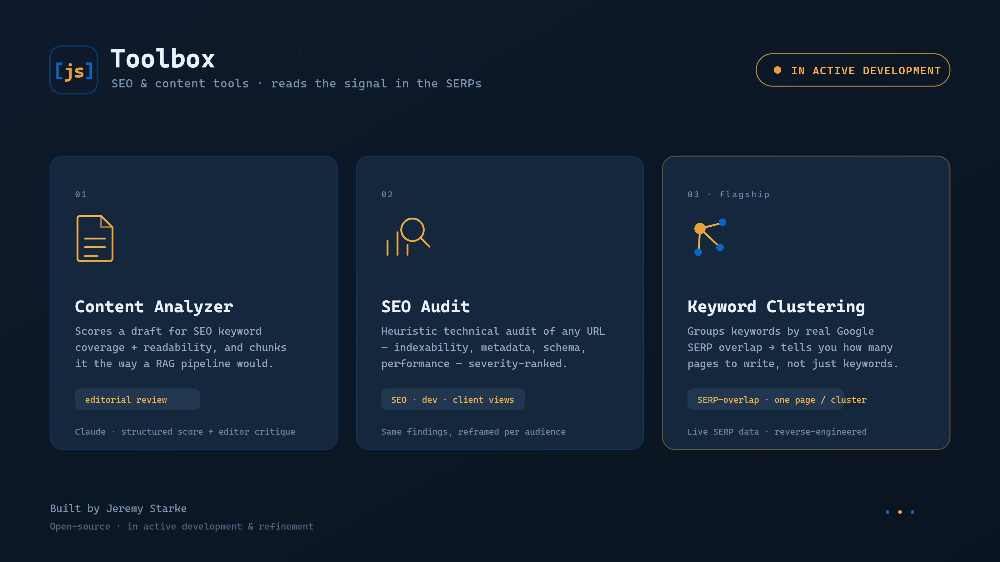

# [js] Toolbox

> 🚧 **In active development & refinement.** Features, UI, and APIs are still evolving — expect rough edges.

A small toolbox of SEO & content utilities — three focused tools behind one clean, keyboard-light interface, with a light/dark theme. Built by [Jeremy Starke](https://jeremystarke.com).

## The tools

### 1 · Content Analyzer
Scores a draft for SEO keyword coverage and readability, and breaks it into **chunks the way a RAG/embedding pipeline would ingest it** — so you catch thin or off-topic sections before publishing. It has two passes: a structured, metric-driven **Analyze**, and a separate **Editorial Review** pass — direct, candid editor feedback for a qualitative gut-check on whether the writing actually lands.

### 2 · SEO Audit
A **heuristic** technical-SEO audit of any URL — indexability, metadata & head tags, structured data, performance signals, mobile/UX, and internationalization — returned as severity-ranked findings, each with a concrete fix. The same findings can be reframed for an SEO specialist, a developer, or a non-technical client.

### 3 · Keyword Clustering *(flagship)*
Groups a keyword list by **real Google SERP overlap**: two keywords cluster when search results rank the same pages, which means one page can realistically target them all. It answers the actual content-planning question — *"how many pages do I write, and what does each target?"* — with evidence (the shared ranking URLs), plus volume/difficulty/intent and a one-click content brief per cluster.

> Why SERP overlap beats grouping by words: *"how to grow tomatoes"* and *"growing tomatoes in containers"* sound identical but rank different pages (two pages); keywords with totally different wording can share most of their results (one page). Only the live SERP reveals this.

## How it works

- **Content Analyzer & SEO Audit** call the **Anthropic API** directly from the browser using a key you supply — stored only in your browser's `localStorage`, never in the code.
- **Keyword Clustering** runs through a small **serverless function** that talks to the **DataForSEO** SERP API and keeps its credentials server-side, so they never reach the browser.

## Tech

Vanilla HTML/CSS/JS single-file frontend (no build step) · Cloudflare Pages Function backend (ES modules) · Anthropic API · DataForSEO SERP API · unit-tested clustering engine.

## Status & roadmap

A personal project, actively refined. Known directions: bulk CSV import/export for clustering, saved projects, and wiring the SEO Audit to live Core Web Vitals data. Not yet packaged for one-click self-hosting.

---

Built by **[Jeremy Starke](https://jeremystarke.com)** — I build, I don't just advise.
